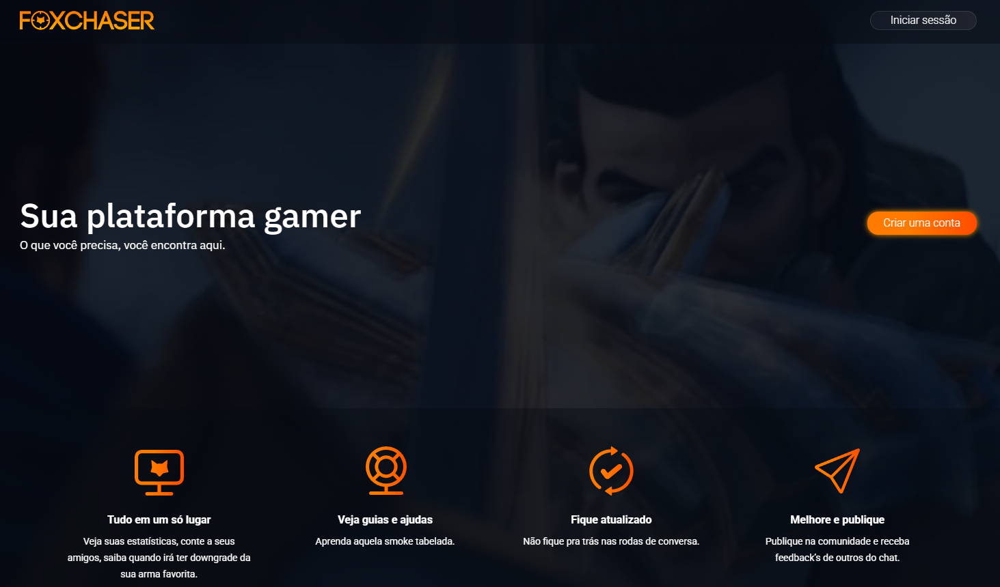

# Protótipo Fox Chaser Automoção em Cypress



> Projeto criado com foco nas funcionalidades principais, de forma simples e objetiva.

## 💻 Pré-requisitos

Antes de começar, verifique se você atendeu aos seguintes requisitos:

- Você instalou as versões mais recentes do `NodeJS`, `Cypress`
- Você tem uma máquina `<Windows>`.

## 🚀 Instalando <Protótipo Fox Chaser Automoção em Cypress>

Para instalar o <Protótipo Fox Chaser Automoção em Cypress>, siga estas etapas:


Windows:

```
<git clone https://github.com/Chefeiro/fox-chaser-automocao-em-cypress>
```

## ☕ Usando <Protótipo Fox Chaser Automoção em Cypress>

Para usar <Protótipo Fox Chaser Automoção em Cypress>, siga estas etapas:

```
<Com o Cypress e NodeJS instalados em sua ultima versão.>

**Abra o terminal, e digite no terminal**
<npx cypress open>

```

## ❌ Possiveis ERROS

Após a execução do comando npx cypress open, caso algum erro seja apresentado após retestar a automação, reinicie o Cypress e execute-o novamente.

## ❄️ Colaboradores

 🪐 **Jonas Silva** 🪐

<QA Enginner | Cypress Automation>

  

 [LinkdIn](https://www.linkedin.com/in/jonas-ferreira-a78200232/)

 🦊 **Pietro Crestani** 🦊

 <Owner FoxChaser | Developer Full Stack>

  

 [LinkdIn](https://www.linkedin.com/in/pietro-crestani-b1515b21b)

## 📝 Licença

Esse projeto está sob licença. Veja o arquivo [LICENÇA](LICENSE.md) para mais detalhes.


